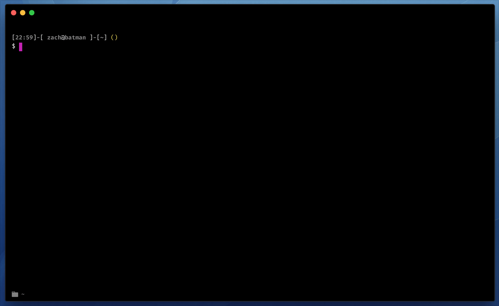

[](https://www.npmjs.com/package/hpm-confirm) [](https://www.npmjs.com/package/hpm-confirm) [](https://www.npmjs.com/package/hpm-confirm)

# hyper-confirm

`hyper-confirm` is a plugin for [Hyper](https://hyper.is/) (formerly HyperTerm) that shows a confirmation dialog before quitting Hyper. This functionality, which is found in other terminal emulators like [iTerm2](https://www.iterm2.com/), provides a safety net against accidentally quitting Hyper (a common problem outlined in [Hyper Issue #399](https://github.com/zeit/hyper/issues/399)).

**Note: Credit for the core functionality of this plugin should go to [@albinekb](https://github.com/albinekb), who opened [this unmerged pull request](https://github.com/zeit/hyper/pull/403) about a year ago.**



## Installation

### Via [hpm](https://github.com/zeit/hpm)

To install `hyper-confirm` via `hpm` (recommended), run the following command in your terminal:

```
hpm install hyper-confirm
```

### Manually

If you don't use `hpm`, add `hyper-confirm` to the `plugins` array in your Hyper config file (typically found at `~/.hyper.js`):

```javascript
  plugins: [
    ...
    'hyper-confirm'
  ]
```

## Configuration

The quit confirmation dialog is disabled by default. To enable it, add `confirmQuit: true` to the `config` object in your Hyper config file (typically found at `~/.hyper.js`):

```javascript
  module.exports = {
    config: {
      ...
      confirmQuit: true
    },
    ...
  };
```

## License

`hyper-confirm` is released under the [MIT License](LICENSE.md).
